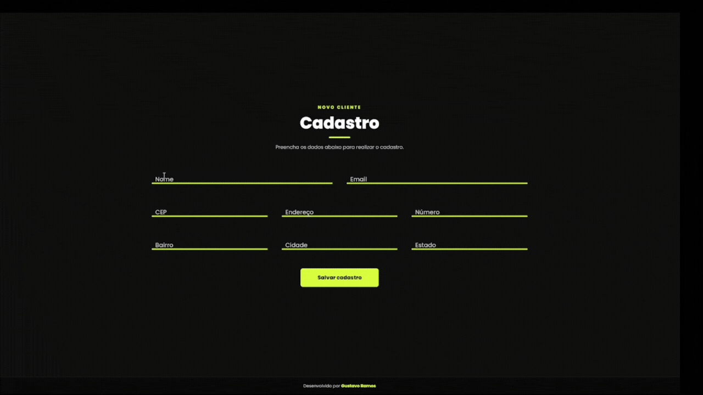

# CADASTRO VIACEP

Formulário de cadastro com preenchimento automático de endereço através da API ViaCEP.

  

---

## Sobre o projeto

A aplicação foi desenvolvida em JavaScript puro (Vanilla JS) e utiliza a API pública ViaCEP para consultar informações a partir do CEP informado pelo usuário.

Ao digitar o CEP e sair do campo, a aplicação realiza automaticamente a consulta e preenche os campos de endereço, bairro, cidade e estado.

---

## Tecnologias utilizadas

- HTML
- CSS
- JavaScript
- Fetch API
- Async / Await
- API ViaCEP

---

## Desenvolvido por

Gustavo Ramos